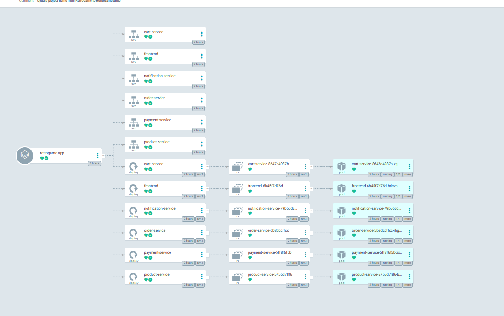
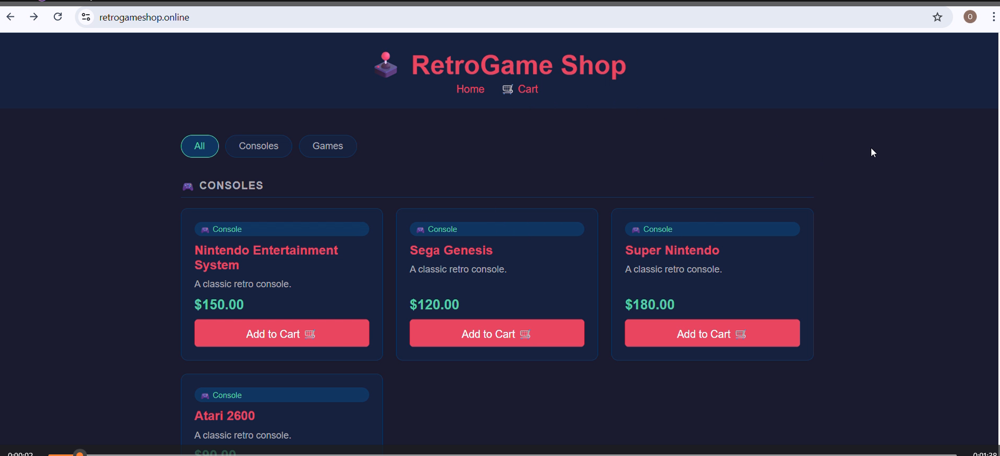

# ☸️ RetroGame Shop K8s Manifests
Kubernetes manifests for RetroGame Shop | GitOps with ArgoCD | Managed by CI/CD pipeline

[](https://retrogameshop.online)
[](https://github.com/Edwin-Oghenetejiri1/retrogame-k8s-manifests)
[](https://kubernetes.io)

---

## 📋 Overview

This repository contains all Kubernetes manifests for the RetroGame microservices platform. It follows the GitOps pattern — ArgoCD watches this repository and automatically deploys any changes to the EKS cluster.

---

## ☸️ What is Kubernetes and Why Does It Matter?

Kubernetes (K8s) is a highly popular open source container orchestration platform originally developed by Google and now maintained by the Cloud Native Computing Foundation (CNCF). It is the industry standard for deploying, scaling and managing containerized applications in production.

Running containers with Docker alone is not enough for production systems. Docker runs containers on a single machine but what happens when that machine goes down? What happens when traffic spikes and you need more instances? What happens when a container crashes at 3am? Kubernetes solves all of this automatically.

### Key Benefits:

**📈 Auto Scaling**
Kubernetes automatically scales your application up or down based on CPU, memory or custom metrics. When traffic spikes, new pods spin up in seconds. When traffic drops, unused pods are removed to save cost. This project uses Karpenter to also scale the underlying EC2 nodes dynamically.

**🔍 Service Discovery and Load Balancing**
Kubernetes gives every service a stable DNS name inside the cluster. Services find each other by name — `http://cart-service:8081` — without hardcoding IP addresses. Kubernetes automatically load balances traffic across multiple pod replicas.

**🔄 Self Healing**
If a container crashes, Kubernetes automatically restarts it. If a node goes down, Kubernetes reschedules all its pods onto healthy nodes. If a pod fails its health check, Kubernetes stops sending traffic to it and replaces it — all without human intervention.

**📦 Replica Sets**
Kubernetes ensures your desired number of pod replicas are always running. Define `replicas: 3` and Kubernetes guarantees 3 instances of your service are always alive. If one dies, a new one is created immediately to maintain the desired state.

**🚀 Rolling Updates and Zero Downtime Deployments**
When you deploy a new version, Kubernetes gradually replaces old pods with new ones — one at a time — ensuring the application is always available during updates. If the new version fails health checks, Kubernetes automatically rolls back to the previous version.

**📁 Declarative Configuration**
You describe the desired state of your system in YAML files — Kubernetes makes it happen and keeps it that way. This repository is the single source of truth for what runs in the cluster.

**🔒 Resource Management**
Define exactly how much CPU and memory each service gets. Kubernetes enforces these limits, preventing one misbehaving service from starving the others of resources.

**🌐 Multi-Cloud and Vendor Neutral**
The same Kubernetes manifests work on AWS EKS, Google GKE, Azure AKS or any on-premise cluster. No vendor lock-in — your application is truly portable.

---

## 🔄 GitOps Flow
```
Developer pushes code to microservices repo
↓
GitHub Actions CI builds and tests
↓
Docker image pushed to DockerHub
↓
CI automatically updates image tag in THIS repo
↓
ArgoCD detects the commit (within 3 minutes)
↓
ArgoCD applies updated manifests to EKS cluster
↓
Kubernetes performs rolling update
↓
Zero downtime deployment ✅

```

---
## 🛠️ Manifest Structure

**Deployment Example:**
```yaml
apiVersion: apps/v1
kind: Deployment
metadata:
  name: frontend
spec:
  replicas: 1
  selector:
    matchLabels:
      app: frontend
  template:
    spec:
      containers:
      - name: frontend
        image: oghenetejiri798/frontend:latest
        ports:
        - containerPort: 3000
```

**Service Example:**
```yaml
apiVersion: v1
kind: Service
metadata:
  name: frontend
  namespace: retrogame
spec:
  selector:
    app: frontend
  type: ClusterIP    # ClusterIP for production (ALB handles external traffic)
  ports:
    - port: 3000
      targetPort: 3000
```

---

## 🚀 Running Locally

To test manifests locally you need:
- `kubectl` installed
- A running Kubernetes cluster (minikube, kind, or Docker Desktop)

**1. Change service type to NodePort for local access:**
```yaml
spec:
  type: NodePort
  ports:
    - port: 3000
      targetPort: 3000
      nodePort: 30000  # Access via localhost:30000
```

**2. Apply manifests:**
```bash
kubectl apply -f frontend/
kubectl apply -f product-service/
kubectl apply -f cart-service/
kubectl apply -f order-service/
kubectl apply -f payment-service/
kubectl apply -f notification-service/
```

**3. Access the app:**

http://localhost:30000

---

## ☸️ Production Deployment (EKS + ArgoCD)

In production this repo is managed by ArgoCD running on AWS EKS:

| Component | Detail |
|---|---|
| Cluster | AWS EKS (Kubernetes 1.32) |
| Namespace | retrogame |
| GitOps Tool | ArgoCD |
| Sync Policy | Automated (every 3 minutes) |
| Load Balancer | AWS ALB (Application Load Balancer) |
| Node Scaling | Karpenter |
| Custom Domain | retrogameshop.online |
| SSL | AWS ACM Certificate |

**ArgoCD Application Config:**
```yaml
apiVersion: argoproj.io/v1alpha1
kind: Application
metadata:
  name: retrogame-app
  namespace: argocd
spec:
  source:
    repoURL: https://github.com/Edwin-Oghenetejiri1/retrogame-k8s-manifests.git
    path: .
    directory:
      recurse: true    # scans all subfolders
  destination:
    namespace: retrogame
  syncPolicy:
    automated:
      prune: true       # removes deleted resources
      selfHeal: true    # reverts manual changes
```

---

## 🌐 Services and Ports

| Service | Port | Type | Description |
|---|---|---|---|
| Frontend | 3000 | ClusterIP | Main UI — only service exposed via ALB |
| Product Service | 8080 | ClusterIP | Product catalog API |
| Cart Service | 8081 | ClusterIP | Shopping cart API |
| Order Service | 8082 | ClusterIP | Order management API |
| Payment Service | 8083 | ClusterIP | Payment processing API |
| Notification Service | 8084 | ClusterIP | Notification API |

> **Note:** All services are ClusterIP in production. Only the frontend is exposed externally via AWS ALB. Backend services communicate internally using Kubernetes DNS (e.g. `http://cart-service:8081`).

---

## 🖥️ Production Screenshots

### ArgoCD — App Synced


### ArgoCD — Resource Tree


### Live Site


### Grafana Monitoring


---

## 🔗 Related Repositories

| Repository | Description |
|---|---|
| [RetroGame Microservices](https://github.com/Edwin-Oghenetejiri1/retrogame-microservices-k8s) | Application source code and CI/CD pipelines |
| [RetroGame EKS Infrastructure](https://github.com/Edwin-Oghenetejiri1/retrogameshop-eks-infra) | Terraform EKS infrastructure with GitHub Actions |

---

<div align="center">
  <strong>🌐 Live at <a href="https://retrogameshop.online">retrogameshop.online</a></strong>
</div>
